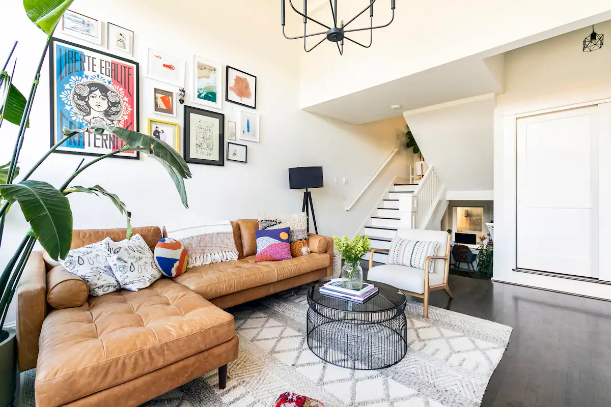
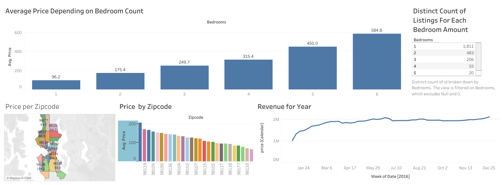
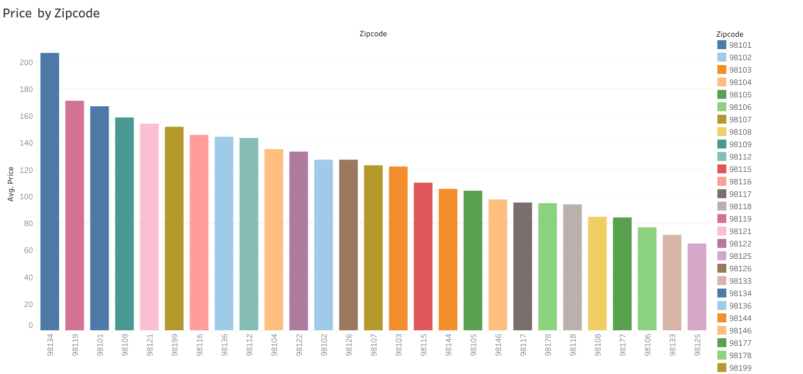
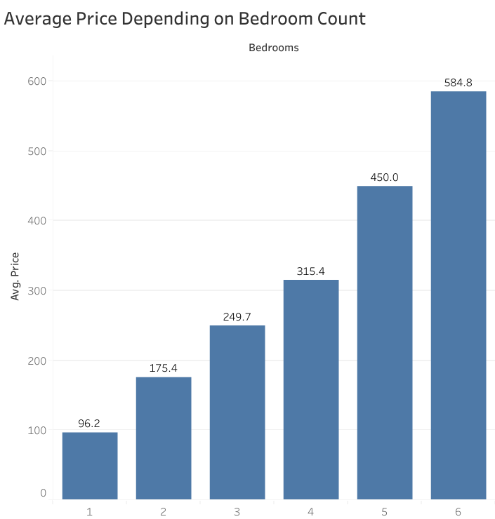
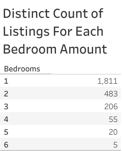

 # Deciding on opening a new Airbnb

 
 ## Overview

I am deciding on getting into the market of renting out an Airbnb in the seattle area and want to know information on the average cost in different areas as well as what the competition will look like.

## Data Sourcing
the data comes from [kaggle](https://www.kaggle.com/datasets/airbnb/seattle) from the year 2016 

## Visualizations and Analysis 

This Dashboard shows an overview of a number of metrics for easy comparison.

Here we can see the average price in each zipcode and see that the 98119 area is most expensive.

This table compares the average cost of a rental depending on how many rooms are in the house.

Here we can see how many listing there are depending on the room count we can see that the market is quit competitive in the one bedroom range and very small competition in the 6 bedroom market.

## Strategy and Decision
I don't want to deal with a bunch of competition with my rental property and I am not concerned about costs so based on the data I am going to buy a 6 house in the 98119 area top set up as an Airbnb rental. 
